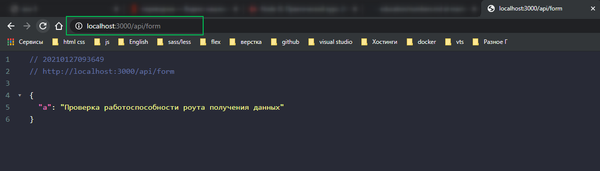

И так подробнее опишу все позже.

описание запуска приложения. Отлавливание значений из формы и отправка их в body.

```js
//app.js entry point
var express = require('express');
var path = require('path');
var cookieParser = require('cookie-parser');
const bodyParser = require('body-parser');
var logger = require('morgan');

const PORT = process.env.PORT || 3000;

const formRouter = require('./routes/form');

var app = express();

app.use(logger('dev'));
app.use(cookieParser());
app.use(express.static(path.join(__dirname, 'public')));

var jsonParser = bodyParser.json();
var urlencodedParser = bodyParser.urlencoded({
  type: 'application/json',
  extended: false,
});

app.use('/form', jsonParser, urlencodedParser, formRouter);

async function start() {
  app.listen(PORT);
  console.log(`Запущено на порту ${PORT}`);
}

start();
```

```js
// formValue
const { form } = document.forms;

async function retrieveFormValue(event) {
  event.preventDefault();

  const formData = new FormData(form);
  const values = Object.fromEntries(formData.entries());
  console.log(values);

  const formValueToJson = await fetch('/form', {
    method: 'POST',
    headers: { 'Content-Type': 'application/json' },
    body: JSON.stringify(values),
  });
  // console.log(values);
  let result = await formValueToJson.json();
  console.log(result);
}

document
  .querySelector('.sendButton')
  .addEventListener('click', retrieveFormValue);

// form.addEventListener('.sendButton');
```

```js
// routes/form.js
var express = require('express');
var router = express.Router();
// const uuid = require('uuid'); // генерирует уникальный id для сервера

let values = [{}];

router.get('/', function (req, res) {
  res.json(values);
});

router.get('/:id', (req, res) => {
  const valueId = parseInt(req.params.id, 10);
  const value = values.find((value) => value.id === valueId);

  if (value) {
    return res.json(value);
  } else {
    return res.status(404).json({
      status: `Значение id ${valueId} не найдено`,
    });
  }
});

router.post('/', (req, res) => {
  const value = {
    q1: req.body.q1 || `req.body.q1 = ${req.body.q1}`,
    q2: req.body.q2 || `req.body.q2 = ${req.body.q2}`,
    Т1: req.body.Т1 || `req.body.Т1 = ${req.body.Т1}`,
    Т2: req.body.Т2 || `req.body.Т2 = ${req.body.Т2}`,
    V1: req.body.V1 || `req.body.V1 = ${req.body.V1}`,
    V1: req.body.V2 || `req.body.V2 = ${req.body.V2}`,
    M1: req.body.M1 || `req.body.M1 = ${req.body.M1}`,
    M2: req.body.M2 || `req.body.M2 = ${req.body.M2}`,
    work_device:
      req.body.work_device || `req.body.work_device = ${req.body.work_device}`,
    work_device_error:
      req.body.work_device_error ||
      `req.body.work_device_error = ${req.body.work_device_error}`,
    exampleFormControlTextarea1:
      req.body.exampleFormControlTextarea1 ||
      `req.body.exampleFormControlTextarea1 = ${req.body.exampleFormControlTextarea1}`,
  };
  values.push(value);
  return res.json(value);
});

module.exports = router;
```

<br>

Подключение sequelize и MySql

Сначало опиши установку portable MySql. Т.к. она у меня есть пока описывать не буду.

sequelize подключение к MySql

[https://sequelize.org/master/manual/getting-started.html](https://sequelize.org/master/manual/getting-started.html)

sequelize это некоторая обертка над mySql для того что бы обращаясь через Node.js и JavaScript различные интерфейсы мы могли взаимодействовать с этой базой очень комфортно т.е. он добавляет большое количество различного функционала.

```shell
npm install --save sequelize
```

следующий пакет является драйвером для той БД с которой собираемся работать.

```shell
$ npm install --save mysql2
```

В корне создаю папку и называю ее utils и в ней создаю новый файл database.js в котором я буду настраивать sequelize именно для работы с БД.

```json
{
  "name": "form-vts",
  "version": "0.0.0",
  "private": true,
  "scripts": {
    "start": "node app.js",
    "dev": "nodemon app.js"
  },
  "dependencies": {
    "body-parser": "^1.18.3",
    "cookie-parser": "~1.4.4",
    "debug": "~2.6.9",
    "express": "~4.16.1",
    "morgan": "~1.9.1",
    "mysql2": "^2.2.5",
    "sequelize": "^6.5.0",
    "uuid": "^8.3.2"
  },
  "main": "app.js",
  "devDependencies": {
    "@types/express": "github:types/npm-express"
  },
  "repository": {
    "type": "git",
    "url": "git+https://github.com/Konstantine899/form_vts.git"
  },
  "author": "",
  "license": "ISC",
  "bugs": {
    "url": "https://github.com/Konstantine899/form_vts/issues"
  },
  "homepage": "https://github.com/Konstantine899/form_vts#readme",
  "description": ""
}
```

```js
const Sequelize = require('sequelize'); // подключаю библиотеку которая является конструктором. Конструктор нащываю с большой буквы

const sequelize = .... // а это объект в котором описываю конфигурацию


(module.exports = sequelize);
```

В объекте обращаюсь к конструктору в который перадаю некоторые параметры.

```js
const Sequelize = require('sequelize'); // подключаю библиотеку которая является конструктором. Конструктор нащываю с большой буквы

const sequelize = new Sequelize()((module.exports = sequelize));
```

Первым параметором передаю название схемы, модели которую мы создали для БД.



И лучше все эти параметры вынесу в переменные.

```js
const Sequelize = require('sequelize'); // подключаю библиотеку которая является конструктором. Конструктор нащываю с большой буквы

const DB_NAME = 'sampledb';
const USER_NAME = 'root';
const PASSWORD = '4343';

const sequelize = new Sequelize(DB_NAME, USER_NAME, PASSWORD, {});

module.exports = sequelize;
```

Четвертым параметром передаю объект конфигурации.

```js
const Sequelize = require('sequelize'); // подключаю библиотеку которая является конструктором. Конструктор нащываю с большой буквы

const DB_NAME = 'sampledb';
const USER_NAME = 'root';
const PASSWORD = '4343';

const sequelize = new Sequelize(DB_NAME, USER_NAME, PASSWORD, {
  host: 'localhost',
  dialect: 'mysql',
});

module.exports = sequelize;
```

Теперь в файле index.js подключаюсь к БД
В перву очередь подключаю сам файл настроек. **const sequelize = require('./utils/database');**. Теперь для того что бы подсоедениться к БД. Создаю асинхронную фуункцию start.

```js
//app.js entry point
var express = require('express');
var path = require('path');
var cookieParser = require('cookie-parser');
const bodyParser = require('body-parser');
var logger = require('morgan');

const sequelize = require('./utils/database');

const PORT = process.env.PORT || 3000;

const formRouter = require('./routes/form');

var app = express();

app.use(logger('dev'));
app.use(cookieParser());
app.use(express.static(path.join(__dirname, 'public')));

var jsonParser = bodyParser.json();
var urlencodedParser = bodyParser.urlencoded({
  type: 'application/json',
  extended: false,
});

app.use('/form', jsonParser, urlencodedParser, formRouter);

async function start() {
  try {
    await sequelize.sync({ force: true });
    app.listen(PORT);
  } catch (e) {
    console.log(e);
  }
}

start();
```

Данный параметр **{ force: true }** говорит о том что если новые данные конфликтуют со старыми они будут форсированно перетираться на новые. Такой параметр лучше удирать.

<br>
<br>
<br>

Создание модели.

В корне приложения создаю еще одну папку и называю ее models и в ней создаю файл form.js
Здесб потребуются две переменные а именно подключение библиотеки **const Sequelize = require('sequelize');** И файл в котором мы прописывали конфигурацию **const sequelize = require('../utils/database');**

После чего нужно создать модель для form.

```js
const Sequelize = require('sequelize');
const sequelize = require('../utils/database');

const form = ...

module.exports = form;
```

При создании модели, описании таблицы, первым делом я должен обратится к sequelize, который относится к нашему connection, и вызываю у него метод который называется define(). Первым параметром в строковом значении мы указываем название модели которую хотим задать.

```js
const Sequelize = require('sequelize');
const sequelize = require('../utils/database');

const form = sequelize.define('Form', {});

module.exports = form;
```

Вторым параметром передаю набор опций которые буду использовать. И теперь нужно описать поля используя sql

```js
const Sequelize = require('sequelize');
const sequelize = require('../utils/database');

const form = sequelize.define('Form', {
  id: {
    primaryKey: true,
    autoIncrement: true,
    allowNull: false, // запрещаю что бы какое-то поле было потенциальным нулем
    type: Sequelize.INTEGER,
  },
  q1: {
    allowNull: false,
    type: Sequelize.DOUBLE,
  },
});

module.exports = form;
```

<br>
<br>

Пока что модель которая у нас зарегистрирована в sequelize, пока ни как не подключаем.

По этому перехожу в routes/form.js и здесь подключаю данную модель **const Form = require('../models/form');**

```js
// routes/form.js
var express = require('express');
var router = express.Router();
// const uuid = require('uuid'); // генерирует уникальный id для сервера

const Form = require('../models/form');

let values = [{}];

router.get('/', function (req, res) {
  res.json(values);
});

router.get('/:id', (req, res) => {
  const valueId = parseInt(req.params.id, 10);
  const value = values.find((value) => value.id === valueId);

  if (value) {
    return res.json(value);
  } else {
    return res.status(404).json({
      status: `Значение id ${valueId} не найдено`,
    });
  }
});

router.post('/', (req, res) => {
  try {
    const value = {
      q1: req.body.q1 || `req.body.q1 = ${req.body.q1}`,
      q2: req.body.q2 || `req.body.q2 = ${req.body.q2}`,
      Т1: req.body.Т1 || `req.body.Т1 = ${req.body.Т1}`,
      Т2: req.body.Т2 || `req.body.Т2 = ${req.body.Т2}`,
      V1: req.body.V1 || `req.body.V1 = ${req.body.V1}`,
      V1: req.body.V2 || `req.body.V2 = ${req.body.V2}`,
      M1: req.body.M1 || `req.body.M1 = ${req.body.M1}`,
      M2: req.body.M2 || `req.body.M2 = ${req.body.M2}`,
      work_device:
        req.body.work_device ||
        `req.body.work_device = ${req.body.work_device}`,
      work_device_error:
        req.body.work_device_error ||
        `req.body.work_device_error = ${req.body.work_device_error}`,
      exampleFormControlTextarea1:
        req.body.exampleFormControlTextarea1 ||
        `req.body.exampleFormControlTextarea1 = ${req.body.exampleFormControlTextarea1}`,
    };
    values.push(value);
    return res.json(value);
  } catch (e) {
    console.log(e);
    res.status(500).json({
      message: 'Ошибка отправки данных',
    });
  }
});

module.exports = router;
```


Отправка в БД не происходит!!!

Немного поправляю POST запрос. Для отправки данных в БД необходимо обратится к таблице, у меня Form и вызвать у нее метод create. В параметрах указываю передаваемые поля.
