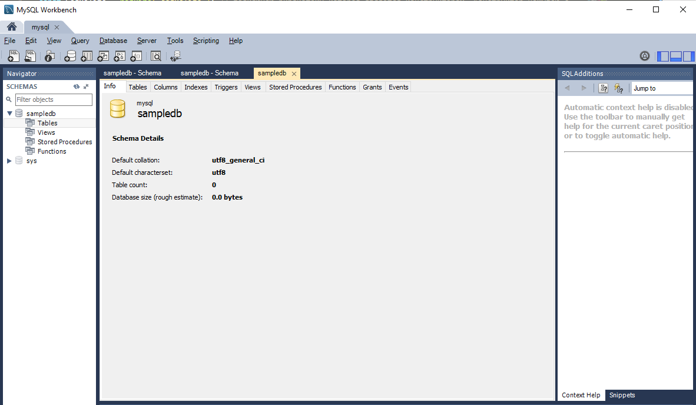

# Настройка роутера.

В корне приложения завожу папку **routes**. Роут обзываю как хочу.**js**. К примеру **form.js**.

```js
const { Router } = require('express');
const router = Router();

module.exports = router;
```

После экспорта из файла у нас будет 4-ре вида запросов и все по одному роуту.

```js
const { Router } = require('express');
const router = Router();

router.get('/', (req, res) => {
  res.json({
    a: 'Проверка работоспособности роута получения данных',
  });
});

router.post('/', (req, res) => {});

// изменение
router.put('/:id', (req, res) => {});

router.delete('/:id', (req, res) => {});

module.exports = router;
```

После создания роута подключаю его в **entry point** приложения т.е. в **index.js**. Допустим **const formRoutes = require('./routes/form');**

Далее я должен добавить новый **middleware** т.е. **app.use()** куда первым параметром передаю префикс, это очень важно, указываю префикс **/api/**, все запросы мы будем отсылать именно по адресу **api**. Т.е. у тех запросов у которых есть префик **api**, они будут служить как раз таки для отдачи каких-либо данных, в моем случае это **json**. После этого префикса указываю имя роута **'/api/form'**. Вторым аргументом он принимает роут который мы импортировали **formRoutes**.

```js
const express = require('express');
const path = require('path');
const formRoutes = require('./routes/form');
const app = express();
const PORT = process.env.PORT || 3000;

app.use(express.static(path.join(__dirname, 'public')));

app.use('/api/form', formRoutes);

app.use((req, res, next) => {
  res.sendFile('/index.html');
});

app.listen(PORT);

start();
```

И пока этот роут не работает. Но я могу проверить работоспособность перейдя по роуту.


