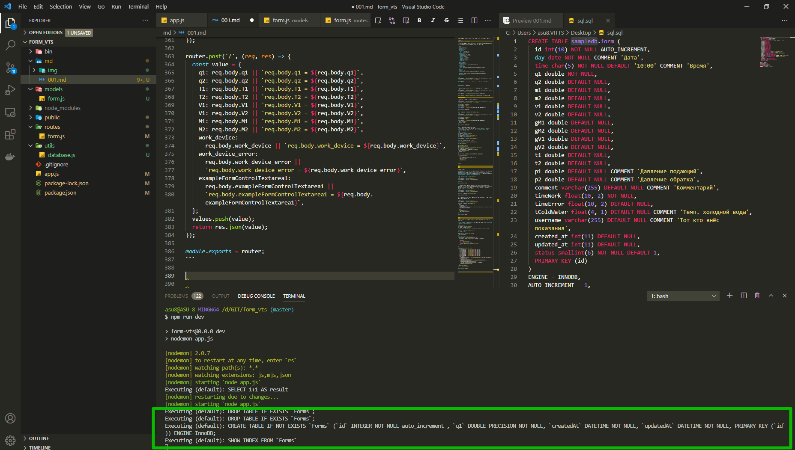
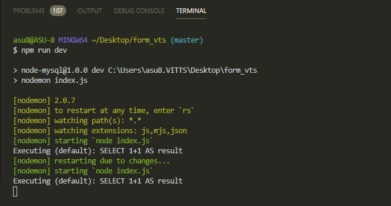

# Подключение к БД.

Для этого я использую [https://sequelize.org/master/manual/getting-started.html](https://sequelize.org/master/manual/getting-started.html)

Смотрю по документации установку

```shell
npm install --save sequelize
```

В корне приложения создаю папку **utils** и в ней создаю файл **database.js** где я буду настраивать **sequelize** для того что бы он соеденился с базой. Но перед этим еще нужно установить пакет. Смотри в документации.

```shell
npm install --save mysql2
```

Этот пакет является некоторым драйвером для выбора БД. Подключаю пакет **const Sequelize = require('sequelize');**

Далее создаю объект **sequelize** =, т.е. с большой буквы это конструктор, а с маленькой объект. И в конце скрипта я просто экспортирую из файла этот объект.

```js
const Sequelize = require('sequelize');

const sequelize =.... // Здесь нужно проинициализировать БД

module.exports = sequelize;
```

Для инициализации я обращаюсь к **new Sequelize()** и в класс конструктора я передаю некоторые параметры. Первым параметром я передаю название той схемы которую мы создали для БД.



Данные параметры я выношу в переменные.

```js
const Sequelize = require('sequelize');

const DB_NAME = 'sampledb';
const USER_NAME = 'root';
const PASSWORD = '4343';

const sequelize = new Sequelize(DB_NAME, USER_NAME, PASSWORD, {});

module.exports = sequelize;
```

Четвертым параметром передаю объект конфигурации где по сути есть множество. В них я хочу явно указать **host: 'localhost'**, и так же я хочу добавить еще один параметр который называется **dialect: 'mysql'**, по умолчанию он такой же, но лучше указать явно.

```js
//utils/database.js
const Sequelize = require('sequelize');

const DB_NAME = 'sampledb';
const USER_NAME = 'root';
const PASSWORD = '4343';

const sequelize = new Sequelize(DB_NAME, USER_NAME, PASSWORD, {
  host: 'localhost',
  dialect: 'mysql',
});

module.exports = sequelize;
```

Теперь в **index.js** подключаюсь к базе. Для этого создаю переменную **sequelize** и в нее подключаю файл **const sequelize = require('./utils/database');**

Теперь для того что бы подсоедениться к БД я создаю функцию async **function start(){}**. В блоке **try** **catch** я буду запускать приложение. С помощью оператора **await** я обращаюсь к объекту **sequelize**, который на текущий момент полностью настроен для соеденения с базой, и далее вызываю у него метод который называется **sync()**. После этого я вызываю запуск нашего **express** приложения. т.е. это выглядит следующим образом.

```js
const express = require('express');
const path = require('path');
const formRoutes = require('./routes/form');
const sequelize = require('./utils/database');
const app = express();
const PORT = process.env.PORT || 3000;

app.use(express.static(path.join(__dirname, 'public')));

app.use('/api/form', formRoutes);

app.use((req, res, next) => {
  res.sendFile('/index.html');
});

async function start() {
  try {
    await sequelize.sync();
    app.listen(PORT);
  } catch (e) {
    console.log('Ошибка подключения к БД', e);
  }
}

start();
```

Далее пишу команду

```shell
node index
```

или

```shell

npm run dev
```

Если ошибок нет значит приложение работает.


